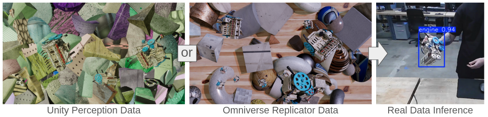

# Synth Perception   
Robotics perception utilizing synthetic data derrived from real object-centric data.  
  
  
This package supports the training of object detection and pose estimation models on synthetic data generated using [Unity Perception](https://github.com/Unity-Technologies/com.unity.perception). More recently, [Omniverse Replicator](https://docs.omniverse.nvidia.com/extensions/latest/ext_replicator.html) has been adopted for data generation for improvements in both visual quality and ease of customization. The replicator_docker folder contains the necessary scripts for running Replicator inside a docker container and using it to generate custom synthetic data.  
Object models used in synthetic data generation are created via training NeRF models in [NerfStudio](https://docs.nerf.studio/) on object data generated using the [NIST MOAD Data Collection Rig](https://www.robot-manipulation.org/nist-moad).  
   
Progress thusfar includes scripts for converting the Unity Perception data format into [YOLO's Data Format](https://docs.ultralytics.com/datasets/detect/#ultralytics-yolo-format), training, and testing an object detection model trained on synthetic image data. Additionally, I have implemented a Pose Estimation model architecture based on the TQ-Net described in [Liu et al. 2020](https://ieeexplore.ieee.org/document/8868108), a script for converting Unity Perception data into a dataset for training this Pose Estimation model, and scripts for the training and subsequent testing of Pose Estimation models.  
   
### Important scripts in this repository are described below:  
#### Data Generation (Omniverse Replicator):  
##### replicator_to_yolo_dataset.py  
Combines an arbitrary number of synthetic data batches directly output from Replicator into a single training dataset formatted for directly training a YOLO detection model.   

#### Data Generation (Unity):  
##### unity_to_yolo_dataset.py  
Combines an arbitrary number of synthetic data batches directly output from Unity Perception, into a single training dataset formatted for directly training a YOLO detection model. It will first check each dataset provided for the object labels used, and combine them into a consistent master list so that datasets with different object annotations may easily be combined together. It is required that the Unity data contains annotations for 2D bounding boxes.  
  
##### unity_to_pose_dataset.py  
Combines an arbitrary number of synthetic data batches directly output from Unity Perception into a single training dataset formatted for the pose estimator model defined in **pose_estimator_model.py**. It is required that the Unity data contains annotations for both 2D and 3D bounding boxes.  
   
#### YOLO Object Detection:  
**yolo_train.py** - Loads a base YOLO model and a specified dataset generated by *unity_to_yolo_dataset.py*, and trains the model for a specified number of epochs.    
   
**yolo_test.py** - Loads a specified trained detection model and a list of image paths, runs each of the images through the detection model, draws the result, and saves the result image to a specified output directory.  
   
**yolo_live_demo.py** - Loads a specified trained detection model, opens a live camera feed to visualize object detections in real time. Additionally, draws the frame processing time in the corner.   
   
#### Pose Estimation:  
**pose_estimator_model.py** - Defines the network architecture of the Pose Estimation model using PyTorch. Also defines a custom data loader which is used to load datasets generated by *unity_to_pose_dataset.py*.  
   
**pose_estimator_train.py** - Trains a pose estimation model using a dataset generated by *unity_to_pose_dataset.py*. Automatically saves loss plots and logs training hyperparameters and other information to a csv log.  
    
**pose_estimator_test.py** - Similar to *yolo_test.py*, loads a set of images to pass through trained detection and pose estimation models, and saves the visualized result to an output directory.  
   
**pose_estimator_test_gt.py** - Similar to *pose_estimator_test.py*, but only expects to test on synthetic Unity datasets, and uses ground truth 2D bounding boxes as detections rather than relying on a detection model.  
   
**pose_estimator_live_demo.py** - Loads a specified detection model and pose estimation model, opens a live camera feed, and visualizes the output of each network in separate windows.  